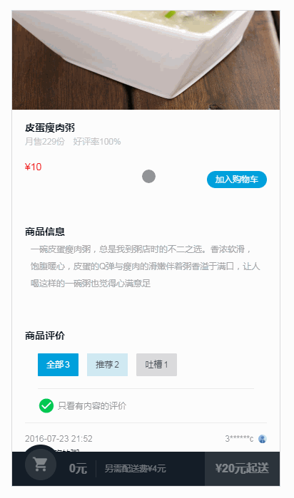
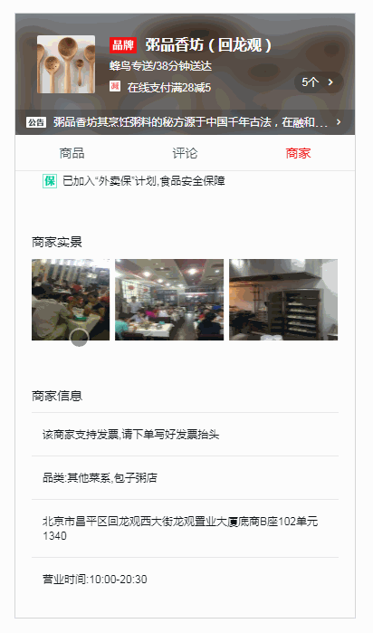

# vue-sell


> 项目来源于慕课网，Vue.js高仿饿了么外卖 App  课程。

欢迎`issue`，`pr`，`star` or `follow`！


## 工具&技能

`Vue 2.x` + `Vue-Resource`+ `Vue Router` 技术框架

`HTML`  + `Stylus` + `ES6+` 技术语言

`webpack 2.0` 构建工具

`better-scroll` 移动端滚动库


## 实现功能

- 商品列表页面

- 商品详情页

- 购物车弹层

- 商品评论页面

- 商家详情页


## 部分效果截图

  








[更多效果gif图](./desc/)


## 目录结构
```
|
|—— build 
|—— config
|—— dist
|   |—— static 
|   |__ index.html 
|——src 
|   |—— components
|   |—— common 
|   |—— App.vue 
|   |__ main.js 
|

```
